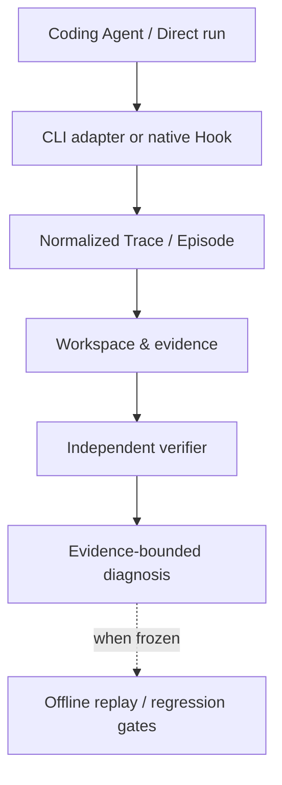

# SameScale

**AI Coding Agent 运行验证与诊断工作台**

*AI Coding Agent Evaluation & Diagnosis Workbench*

把 Coding Agent 的一次运行，转化为可检查、可诊断、可复核的工程证据。
SameScale 关联 Trace、Episode、workspace changes 和独立验收，帮助回答：实际发生了什么、哪些结果已验证、失败停在哪一层，以及保存的证据能否离线复核。它不把局部运行结果写成模型排行榜。

**[打开只读 Recruiter Demo](https://getsamescale.com/demo/)** · [下载离线 HTML](docs/recruiter/demo/index.html) · [4 分钟讲解稿](docs/RECRUITER_DEMO.md)

## Why SameScale

Agent 说“done”只是一次输出，不等于任务契约通过。工程复盘还需要检查最终 workspace、工具轨迹和独立 verifier，区分任务失败、环境中断与尚未证实的模型或运行时原因。保留原始状态与未知项，才能在不再次调用模型的情况下复核结论。

## How it works

这是系统中已有的证据处理阶段，不是每条历史运行都走完的时间线。不同来源的证据保持各自身份；缺失的原生字段保持 unknown。Native Hook 的受控验收记录见下方 Case B，其实现与原件尚未进入远端 `main`。

## Engineering highlights

- **Trace / Episode evidence binding.** 将运行事件、文件变化和验收来源绑定到可检查的记录。事件中的路径提及不能代替真实 workspace diff，缺失的退出码也不能从 stdout 猜测。
- **Independent verification.** 用任务契约检查最终 workspace，将 Agent 自报、进程退出和任务验收分开。原 Episode 未运行 verifier 时，后续审计不能回填原结果。
- **Failure diagnosis.** 按可观察证据描述 timeout、workspace contract failure 和未知状态；把失败位置与模型、Provider 或 Harness 的根因归属分开。
- **Deterministic offline replay.** 从冻结、摘要绑定的记录重建分析，并拒绝缺失、漂移或矛盾的输入；不重跑 Agent、模型、trace 中的命令或原 verifier。
- **CI / regression gates.** 用无模型调用的离线检查约束 evidence reader、文件归属和失败分类。CI 能验证保存记录的处理契约，不自动证明某个案例已进入同一条 CI 链路。
- **Configuration and evidence boundaries.** 固定任务、配置与预算身份；只在可比条件和足够证据下讨论差异。`L0` 确定性验证、`L1` 人工 gold、`L2` Judge 保持不同权威层级。

## Evidence stories

以下是**两条独立的证据链**，其数字和产物不合并。

### Case A — Timeout → offline workspace audit

一次真实 A Candidate 运行到时限后保存了 5 个修改文件。原 Episode 保持 `NOT_VERIFIED`，verifier 为 `NOT_RUN`、0 checks。随后对**保存的 workspace** 做独立离线审计，冻结 verifier 报告 **71/75**，并发现受测语言标签契约失败。

**The offline audit is not the original Episode verifier.** 此案例不主张 replay 或 CI 连续性，也不把 71/75 写成原运行的正式成绩。[原运行](docs/evidence/l1-a-candidate-real-20260921/README.md) · [离线审计](docs/evidence/l1-a-candidate-offline-audit-20260921/README.md)

### Case B — Native Hook → verified workspace Bad Case → offline replay

另一条受控 fixture 记录复用了真实 Codex session 的 native Hook 收据。Hook 未原生提供可靠的 command exit code，因此 Trace 保持 `UNKNOWN`。独立 verifier 检查最终 workspace：**1 PASS / 3 FAIL**；受限于 workspace contract 的 Bad Case 随后冻结，两次 Offline Replay 输出逐字节一致。

**Model root cause: `NOT_ESTABLISHED`. Harness root cause: `NOT_ESTABLISHED`.** Fixture 中的缺陷是预先人工播种的，不构成 Codex 能力或指令遵循失败证明。来源为 `docs/evidence/real-hook-trace-20260922/verifier-closeout/`；该 closeout 目前只在开发工作树中，**尚未提交到远端 `main`**，因此这里不提供虚假的 GitHub 原件链接，也不主张远端 CI 已运行。

## Recruiter Demo

[在线打开只读 Demo](https://getsamescale.com/demo/)：约 3–5 分钟查看 Task → Configurations → Result → Trace Diff → Diagnosis → Offline Replay → 已保存的 CI / regression evidence。它展示的是**另一组 S4 冻结记录**，不是 Case A 或 Case B 的后续步骤；页面不启动 Agent、模型、replay 或验收。

无需账号或 Provider key。也可以在有仓库访问权限时打开 [仓库中的单文件 HTML](docs/recruiter/demo/index.html)，点击 GitHub 的 **Raw** 下载后在浏览器本地打开；GitHub 文件预览本身不会运行 HTML。[讲解与复验路径](docs/RECRUITER_DEMO.md) · [分享边界](docs/evidence/s4-job-search-freeze-20260921/README.md)

## Tech stack

Python · FastAPI · PostgreSQL · SQLAlchemy / Alembic · LangGraph · Vue 3 · TypeScript · Docker · GitHub Actions。现有 `src/harnesslab`、`harnesslab` CLI 与 `HARNESSLAB_*` 配置名保留兼容身份。

## Evidence boundaries

- Unknown stays unknown；`NOT_RUN` 和 `NOT_VERIFIED` 不是通过。
- Agent self-report 和进程 exit code 不能替代独立任务验收。
- 后来的离线审计不会改写原 Episode verifier。
- 不同 run 的 Evidence 不拼成同一条因果故事。
- Workspace 失败本身不能建立模型或 Harness 根因。
- 局部证据不生成模型排名；摘要校验也不单独认证来源真实性。

## For technical review

值得追问的工程点：如何把原生事件与 Episode 绑定而不猜缺失字段？如何把原运行的 `NOT_RUN` 与后来审计分开？Offline Replay 证明了什么、不能证明什么？CI 如何在不调用模型的条件下发现证据读取回归？

| 入口 | 内容 |
| --- | --- |
| [Architecture](docs/ARCHITECTURE.md) | 运行、隔离、证据与 Analyst 边界 |
| [Evaluation methodology](docs/EVAL_METHODOLOGY.md) | 验证权威与可比性 |
| [Recruiter Demo guide](docs/RECRUITER_DEMO.md) | 讲解脚本、离线打开方式与限制 |
| [Evidence records](docs/evidence/) | 按原始运行和审计来源分别保存的记录 |
| [Current milestone](CURRENT_MILESTONE.md) | 已验收状态、未提交工作与阻碍 |
| [Public product contract](PUBLIC_PRODUCT_CONTRACT.md) | 对外能力与声明边界 |
| [Developer setup](docs/PRODUCTIZATION.md) | 本地产品运行与分发细节 |

本仓库沿用 HarnessLab 的实现与历史；README 是入口，具体运行步骤、历史验收和开发记录保留在对应文档中。
